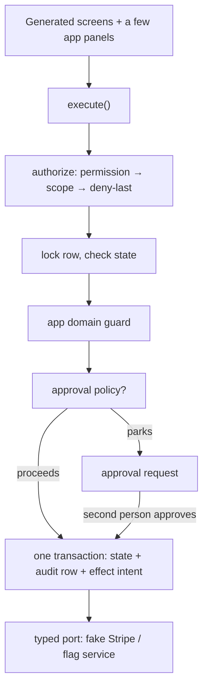

# internal-tools-platform

Three internal tools — a **KYC review queue**, a **refunds dashboard**, and a **feature-flag admin
panel** — built on one shared substrate that enforces authorization, PII masking, audit and
approvals for all of them.

## Try it

### → https://internal-tools-platform.vercel.app

Nothing to install. **There is no login screen — pick a person from the *Acting as* dropdown in the
header first**, or every screen will say no principal is selected. Switching people is the demo:
no policy here can be satisfied by one person acting alone.

| Person | Role | Sees |
|---|---|---|
| Sofia | support agent | Consumer payments and refunds |
| Priya | finance manager | approves refunds over $100 |
| Nadia, Lea | KYC analysts | Consumer cases |
| Raj | KYC analyst | SMB cases only |
| Omar | compliance officer | approves KYC rejections |
| Sam | engineer | flags in `development` / `staging` |
| Renee, Mira | release managers | flags including `production` |
| Ava | auditor | read-only, plus `/audit` |

The data is fake, the third-party providers are in-process fakes, and every visitor shares one
mutable database — approvals get consumed and flags get ramped as people click.

## The three apps

**KYC review queue.** Cases arrive with masked SSN and date of birth. An analyst claims a case,
reveals PII (the reveal is itself an audited event), and approves or rejects. A rejection needs a
compliance officer, and the analyst cannot approve their own. Cases in another business unit are
invisible, and forcing `?reveal=ssn` in the URL still returns masked data.

**Refunds dashboard.** Open a captured payment, request a refund against it. Money is integer minor
units everywhere, and a refund can never push a payment's cumulative refunded total past what was
captured — checked under a row lock, so two concurrent requests for 60% cannot both win. Over $100
parks for a finance manager. When the processor times out the refund goes to `unknown`, not
`failed`: the system refuses to claim the customer was paid.

**Feature-flag admin.** Rollout percentages per environment. Production changes need a second
release manager, a stale editor loses to optimistic concurrency, and a rollout only ramps *up* —
ramping down is a `rollback`, which needs no approval, because requiring sign-off to stop an
incident makes outages longer.

Then open **`/audit`**: one hash-chained trail across all three apps, covering reads, denials,
decisions and approvals.

## Architecture

Two kinds of code, and the boundary between them is the whole point:

- `src/substrate/` — identity, policy engine, field masking, audit chain, state transitions,
  approvals, idempotency, effects, and the registry that generates screens. **No app knowledge.**
- `src/apps/{refunds,kyc,flags}/` — declarations only: state machines, domain guards, approval
  thresholds, fake providers, and a panel or two each. **No authorization or audit logic of their
  own**, so an app cannot forget to enforce them.



What makes it different from generated CRUD that looks similar in a screenshot:

1. **Reads are authorized and audited** on the same path as writes — "who viewed this SSN" is
   answerable.
2. **Masking happens on the server.** The client never receives a value it may not see, so it
   cannot be undone with CSS.
3. **State change and audit row commit together**, enforced by a Postgres trigger — writing domain
   state without an audit row fails at the database.
4. **External calls happen outside the transaction**, via a transactional outbox with idempotency
   keys, so a timeout is `unknown` rather than silently `failed`.
5. **Five outcomes that never collapse into one red toast:** `ok` · `pending` · `denied` ·
   `invalid` · `unknown`. An authority violation, a fat-fingered amount and a processor timeout are
   different things.

**What it cost:** the three apps needed **224 → 27 → 0** lines of substrate change respectively.
The third app was the one most likely to break the design — it scopes by environment rather than
business unit — and needed none. That is the whole claim: app #4 is a few hundred lines of
declaration.

## Limitations

- Authentication is a cookie from a dropdown. Real SSO is a port, not a rewrite, but it is not built.
- Every third-party provider is a deterministic in-process fake — deliberately adversarial
  (duplicate webhooks, timeouts, injected publish failures), because a fake that always returns 200
  deletes the hard part.
- `invalid` domain refusals are not audited; denials and writes are.
- `/audit` shows the last 100 events, unfiltered and unpaginated.
- Setting a staging flag to `66%` fails on purpose, so `publish_failed` is reachable in a demo.

## Running it locally

Only needed to develop or run the tests. Requires Node 20+, pnpm 10+ and Docker (for Postgres).

```bash
git clone https://github.com/warnerktsang/internal-tools-platform.git
cd internal-tools-platform
cp .env.example .env      # local-only values; no real secrets
pnpm install
pnpm db:up                # Postgres 16 on localhost:5433
pnpm db:migrate:deploy
pnpm db:seed
pnpm dev                  # http://localhost:3000
```

```bash
pnpm test            # 166 tests against the real database (truncates it — reseed afterwards)
pnpm audit:verify    # walks the audit hash chain
pnpm typecheck && pnpm lint && pnpm build
```

<details>
<summary>Hosting your own copy, and resetting the demo data</summary>

`vercel.json` sets the build command to `prisma migrate deploy && next build`, so a deploy is a
managed Postgres plus two environment variables:

1. Create a [Neon](https://neon.tech) project and copy the **direct** (non-pooled) connection string.
2. In Vercel, import this repository; `main` is the production branch. Turn *Settings → Deployment
   Protection → Vercel Authentication* **off** if the link is for other people.
3. Set `DATABASE_URL` and `ADMIN_TOKEN` (any long random string) for all environments, and deploy.
   The build runs the migrations, so the schema exists before the first request.
4. Seed once — this is what creates the data:
   `curl -X POST "https://<your-app>.vercel.app/api/demo/reseed?token=$ADMIN_TOKEN"`. The same call
   resets the demo whenever visitors have drifted it.

`GET /api/effects/sweep` (same token) exists to recover an outbox row whose process died between
the commit and the provider call. Nothing schedules it; a production deployment would put it on a
cron or a queue consumer.

</details>
